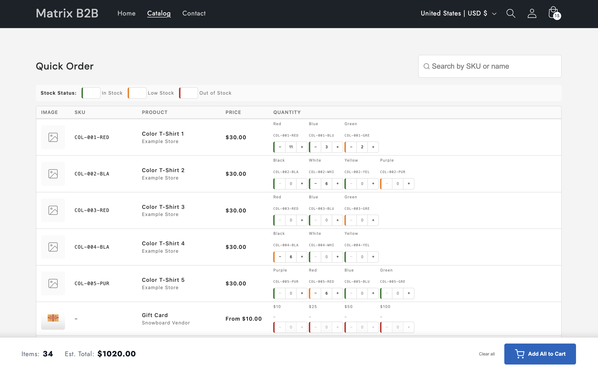

# 🚀 Quick Order Matrix

[](LICENSE)
[](https://shopify.dev)
[](https://alpinejs.dev)

**A spreadsheet-style bulk ordering interface for Shopify B2B stores.**

Quick Order Matrix transforms your Shopify store into a powerful wholesale ordering platform. Let your customers order dozens of products and variants in seconds, not minutes.

> ⭐ **Love this project? Give us a star on GitHub!** It helps others discover us and motivates continued development.



---

## ✨ Features

### For Store Owners

| Feature | Description |
|---------|-------------|
| **⚡ Instant Search** | Search across your entire catalog by product name or SKU—results appear instantly |
| **📊 Matrix Layout** | Spreadsheet-style interface optimized for bulk orders |
| **🎨 35+ Customizable Settings** | Full control via Shopify Theme Editor—no coding required |
| **📦 Live Stock Indicators** | Color-coded stock status (in-stock, low, out-of-stock) |
| **💰 Live Totals** | Real-time item count and estimated totals as customers fill the form |
| **📱 Fully Responsive** | Works beautifully on desktop, tablet, and mobile |
| **🌍 Localization Ready** | All labels and messages are customizable for any language |

### For Developers

| Feature | Description |
|---------|-------------|
| **🔧 Zero Dependencies** | Self-contained bundle with Alpine.js baked in |
| **📁 Clean Architecture** | Follows Shopify theme conventions (`sections/`, `snippets/`, `assets/`) |
| **⚡ Performance Optimized** | Lazy loading, efficient DOM updates, debounced search |
| **🧩 Modular Design** | Easy to extend and customize |
| **🔌 Shopify API Native** | Uses Cart API and collection rendering—no external services |

---

## 📦 Installation

### Option 1: Quick Install (Recommended)

1. **Download the latest release** from the [Releases page](../../releases)
2. **Unzip** the package
3. **Upload files** to your Shopify theme:
   - Copy `sections/quick-order-matrix.liquid` → your theme's `sections/` folder
   - Copy `snippets/*` → your theme's `snippets/` folder
   - Copy `assets/*` → your theme's `assets/` folder
4. **Add the section** to any page via the Theme Editor

### Option 2: Manual Integration

Clone this repository and copy the `src/` contents to your theme:

```bash
git clone https://github.com/YOUR_USERNAME/quick-order-matrix.git
cd quick-order-matrix

# Copy to your theme
cp -r src/sections/* /path/to/your-theme/sections/
cp -r src/snippets/* /path/to/your-theme/snippets/
cp -r src/assets/* /path/to/your-theme/assets/
```

---

## 🚀 Quick Start

### 1. Add to a Page

After installation, add the Quick Order Matrix section to any page:

1. Go to **Online Store → Themes → Customize**
2. Navigate to the page where you want the order matrix
3. Click **Add section** → Select **Quick Order Matrix**
4. Choose your collection and configure settings

### 2. Configure Settings

All settings are accessible through the Theme Editor—no coding required:

| Setting Category | Options |
|------------------|---------|
| **General** | Section title, collection selector, products per page |
| **Layout** | Full width, padding top/bottom |
| **Display** | Show images, SKU column, variant layout (compact/expanded), stock indicators |
| **Labels** | Column headers, stock status labels, button text, messages |

> 📖 See [CUSTOMIZATION.md](docs/CUSTOMIZATION.md) for a complete list of all 35 settings.

---

## 🛠️ Development Setup

### Prerequisites

- Node.js 18+
- Shopify CLI
- A Shopify development store

### Getting Started

```bash
# Clone the repository
git clone https://github.com/YOUR_USERNAME/quick-order-matrix.git
cd quick-order-matrix

# Install dependencies
npm install

# Start development mode (syncs changes to test-theme)
npm run dev

# In a separate terminal, start Shopify theme dev server
npm run theme:dev
```

### Project Structure

```
quick-order-matrix/
├── src/
│   ├── sections/
│   │   └── quick-order-matrix.liquid    # Main section file
│   ├── snippets/
│   │   ├── qom-product-row.liquid       # Product row template
│   │   ├── qom-variant-inputs.liquid    # Variant input controls
│   │   └── qom-product-data.liquid      # Product data JSON pre-render
│   ├── assets/
│   │   ├── qom-controller.js            # Alpine.js controller (bundled)
│   │   └── qom-styles.css               # Component styles
│   └── locales/                         # Translation files
├── test-theme/                          # Test theme for development
├── scripts/
│   ├── sync-to-theme.js                 # File sync for development
│   └── build.js                         # Production build script
├── docs/
│   └── CUSTOMIZATION.md                 # Detailed settings documentation
└── package.json
```

### Available Scripts

| Script | Description |
|--------|-------------|
| `npm run dev` | Watch mode—syncs changes to test-theme |
| `npm run build` | Build production-ready distribution |
| `npm run package` | Create a distributable ZIP file |
| `npm run test` | Run browser tests |
| `npm run theme:dev` | Start Shopify theme development server |

---

## 🎨 Customization

### Theme Editor Settings

Quick Order Matrix provides **35 customizable settings** through the Shopify Theme Editor:

- **3 General settings** — Title, collection, pagination
- **3 Layout settings** — Full width, padding
- **6 Display options** — Images, SKU, variants, stock indicators
- **23 Text/label customizations** — Full localization support

### CSS Customization

All styles use BEM naming with the `qom-` prefix. Override styles in your theme's CSS:

```css
/* Custom styling example */
.qom-container {
  --qom-stock-in: #22c55e;    /* In stock color */
  --qom-stock-low: #f59e0b;    /* Low stock color */
  --qom-stock-out: #ef4444;    /* Out of stock color */
}

.qom-table {
  font-size: 14px;
}
```

### JavaScript Hooks

The controller exposes methods you can call for advanced integrations:

```javascript
// Access the Alpine.js component
const qom = document.querySelector('[x-data="qomController"]').__x.$data;

// Programmatically update quantities
qom.updateQuantity(variantId, quantity, priceInCents);

// Get current cart totals
console.log(qom.totalItems, qom.totalPrice);

// Clear all quantities
qom.resetQuantities();
```

---

## 📊 How It Works

### Architecture Overview

```
┌─────────────────────────────────────────────────────────────┐
│                    Quick Order Matrix                        │
├─────────────────────────────────────────────────────────────┤
│  ┌─────────────┐  ┌─────────────┐  ┌─────────────────────┐  │
│  │   Liquid    │  │  Alpine.js  │  │      Shopify        │  │
│  │  Templates  │──│  Controller │──│      Cart API       │  │
│  └─────────────┘  └─────────────┘  └─────────────────────┘  │
│         │                │                    │              │
│         ▼                ▼                    ▼              │
│  ┌─────────────┐  ┌─────────────┐  ┌─────────────────────┐  │
│  │  Product    │  │   State     │  │   Batch Cart        │  │
│  │  Rendering  │  │  Management │  │   Operations        │  │
│  └─────────────┘  └─────────────┘  └─────────────────────┘  │
└─────────────────────────────────────────────────────────────┘
```

### Key Features Explained

1. **Pre-rendered Product Index**: All product data (including inventory) is rendered as JSON at page load for instant search—no API calls needed during search.

2. **Batched Cart Operations**: Items are added to cart in batches of 10, preventing API rate limits while maintaining fast checkout.

3. **Stock Validation**: Quantities are automatically capped at available inventory, preventing overselling.

4. **Smart Variant Filtering**: When searching by SKU, only matching variants are shown, not the entire product.

---

## 🤝 Contributing

Contributions are welcome! Here's how you can help:

1. **⭐ Star this repo** to show your support
2. **🐛 Report bugs** by opening an issue
3. **💡 Request features** via GitHub issues
4. **🔧 Submit PRs** for bug fixes or enhancements

### Development Guidelines

- Follow existing code style and BEM naming conventions
- Test changes against multiple themes
- Update documentation for new features
- Keep the bundle size minimal

---

## 📝 License

This project is licensed under the **MIT License with Attribution Clause**.

You are free to use, modify, and distribute this software, provided that:

1. The copyright notice and license are included in all copies
2. **A visible "Powered by Quick Order Matrix" attribution link is displayed in any public-facing UI**

See [LICENSE](LICENSE) for full details.

---

## 🙏 Acknowledgments

- Built with [Alpine.js](https://alpinejs.dev) for reactive UI
- Designed for [Shopify](https://shopify.dev) theme development
- Inspired by B2B wholesale ordering workflows

---

## 📧 Support

- **Issues**: [GitHub Issues](../../issues)
- **Discussions**: [GitHub Discussions](../../discussions)

---

<p align="center">
  <strong>Built with ❤️ for the Shopify community</strong>
  <br>
  <sub>If this project helped you, please consider giving it a ⭐!</sub>
</p>
